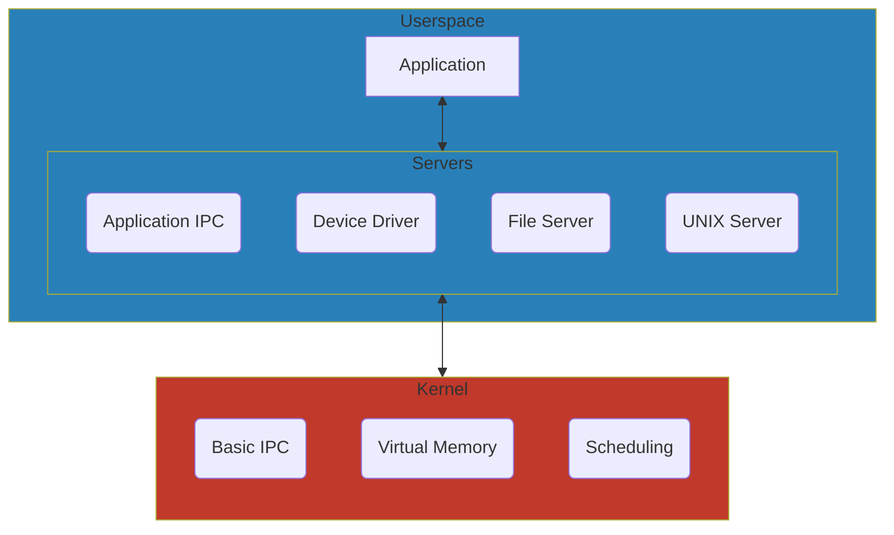

<!--
  NeurOS - Hobbyist operating system written in Rust.
  Copyright (C) 2024 Theomund

  This program is free software: you can redistribute it and/or modify
  it under the terms of the GNU General Public License as published by
  the Free Software Foundation, either version 3 of the License, or
  (at your option) any later version.

  This program is distributed in the hope that it will be useful,
  but WITHOUT ANY WARRANTY; without even the implied warranty of
  MERCHANTABILITY or FITNESS FOR A PARTICULAR PURPOSE. See the
  GNU General Public License for more details.

  You should have received a copy of the GNU General Public License
  along with this program. If not, see <https://www.gnu.org/licenses/>.
-->

# 

> [!WARNING]
> This project is currently in its early development stage. As a result, you
> might find bugs, incomplete features, and unexpected behavior. We appreciate
> your interest and encourage you to offer feedback, but be aware that the
> system is not yet stable for production use. Use it at your own discretion,
> and prepare for potential issues.

## Overview

This project aims to create a lightweight, modular, and extensible operating
system based on the microkernel architecture. The microkernel design minimizes
the kernel's complexity by delegating most tasks to userspace services,
resulting in improved reliability, security, and maintainability.

## Architecture

## License

This project uses the [GNU General Public License v3.0](COPYING) (or later).

You can find the detailed terms of the license in the [COPYING](COPYING) file.
