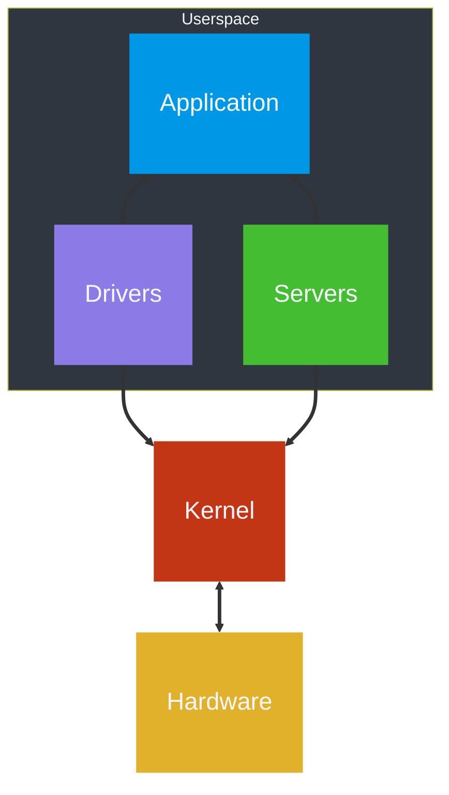

<!--
  NeurOS - Hobbyist operating system written in Rust.
  Copyright (C) 2024 Theomund

  This program is free software: you can redistribute it and/or modify
  it under the terms of the GNU General Public License as published by
  the Free Software Foundation, either version 3 of the License, or
  (at your option) any later version.

  This program is distributed in the hope that it will be useful,
  but WITHOUT ANY WARRANTY; without even the implied warranty of
  MERCHANTABILITY or FITNESS FOR A PARTICULAR PURPOSE. See the
  GNU General Public License for more details.

  You should have received a copy of the GNU General Public License
  along with this program. If not, see <https://www.gnu.org/licenses/>.
-->

# 


> [!WARNING]
> This project is currently in its early development stage. As a result, you
> might find bugs, incomplete features, and unexpected behavior. Be aware that
> the system is not yet stable for production use. Use it at your own
> discretion, and prepare for potential issues.

# Overview

This project aims to create a lightweight, modular, and extensible operating
system based on the microkernel architecture. The microkernel design minimizes
the kernel's complexity by delegating most tasks to userspace services,
resulting in improved reliability, security, and maintainability.

# Architecture



# Building

> [!NOTE]
> Building on Windows or macOS is currently not supported at this time.

To build and compile the operating system from source, follow the outlined
steps. Make sure you have the necessary tools and dependencies installed on
your system.

## Prerequisites

Before building the operating system, ensure you have the following prerequisites installed:

* `edk2-ovmf`
* `gcc`
* `make`
* `qemu`
* `rustup`
* `xorriso`

## Cloning

Clone the repository to your local machine by using the following command:

```bash
git clone https://github.com/Theomund/NeurOS.git
```

## Compiling

Run the following command to generate an ISO image:

```bash
make all
```

This command will start the build process based on the configured settings
and source code.

## Testing

To test the compiled operating system in a virtual environment, run this
command:

```bash
make run
```

This command will start QEMU and run the operating system in BIOS mode. To
switch the mode to UEFI, run the following command:

```bash
make run-uefi
```

## Cleaning

To clean the build artifacts and start fresh, use the following command:

```bash
make clean 
```

This command removes compiled binaries and temporary files.

# License


This project uses the [GNU General Public License v3.0](COPYING) (or later).

You can find the detailed terms of the license in the [COPYING](COPYING) file.
