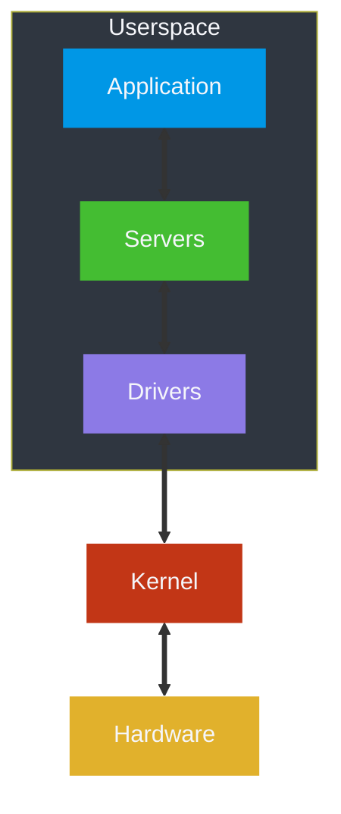

<!--
  NeurOS - Hobbyist operating system written in Rust.
  Copyright (C) 2024 Theomund

  This program is free software: you can redistribute it and/or modify
  it under the terms of the GNU General Public License as published by
  the Free Software Foundation, either version 3 of the License, or
  (at your option) any later version.

  This program is distributed in the hope that it will be useful,
  but WITHOUT ANY WARRANTY; without even the implied warranty of
  MERCHANTABILITY or FITNESS FOR A PARTICULAR PURPOSE. See the
  GNU General Public License for more details.

  You should have received a copy of the GNU General Public License
  along with this program. If not, see <https://www.gnu.org/licenses/>.
-->

# 


> [!WARNING]
> This project is currently in its early development stage. As a result, you
> might find bugs, incomplete features, and breaking changes. Be aware that
> the system is not yet stable for production use. Use it at your own
> discretion, and prepare for potential issues.

# Overview

NeurOS, as its name suggests, centers around
[Neuro-sama](https://en.wikipedia.org/wiki/Neuro-sama), an artificial
intelligence streamer created by [vedal987](https://twitter.com/vedal987).
The primary aim of this operating system is to provide mechanisms facilitating
system interaction by an artificial intelligence.

This project also aims to create a lightweight, modular, and extensible
operating system based on the microkernel architecture. The microkernel design
minimizes the kernel's complexity by delegating most tasks to userspace
services, resulting in improved reliability, security, and maintainability.

# Screenshots


# Roadmap

This delineates the general areas of focus for development (this is
not an exhaustive list):

* [x] **Bootstrapping**
    * [x] Bootloader Configuration
    * [x] Initial RAM Disk
* [ ] **System Initialization**
    * [ ] Global Descriptor Table (GDT)
    * [x] Interrupt Descriptor Table (IDT)
* [ ] **Memory Management**
    * [x] Physical Memory Manager
    * [ ] Virtual Memory Manager
* [ ] **Interrupt Handling**
    * [ ] CPU Exceptions
        * [x] Division Error
        * [x] Debug
        * [x] Non-Maskable Interrupt (NMI)
        * [x] Breakpoint
        * [x] Overflow
        * [x] Bound Range Exceeded
        * [x] Invalid Opcode
        * [x] Device Not Available
        * [x] Double Fault
        * [x] Invalid TSS
        * [x] Segment Not Present
        * [x] Stack Segment Fault
        * [x] General Protection Fault
        * [x] Page Fault
        * [x] x87 Floating Point
        * [ ] Alignment Check
        * [ ] Machine Check
        * [ ] SIMD Floating Point
        * [ ] Virtualization
        * [ ] Control Protection
        * [ ] Hypervisor Injection
        * [ ] VMM Communication
        * [ ] Security
    * [ ] Hardware Interrupts
        * [x] Timer
        * [x] Keyboard
        * [ ] Serial Port
* [ ] **Device Drivers**
    * [ ] Disk
        * [ ] IDE
        * [ ] Serial AT Attachment (SATA)
        * [ ] SCSI
        * [ ] NVMe
    * [ ] Interrupt Controller
        * [x] PIC
        * [ ] Advanced Programmable Interrupt Controller (APIC)
    * [x] Display
    * [x] Serial Port
    * [ ] Timer
        * [ ] Programmable Interval Timer (PIT)
    * [ ] Network Interface Card (NIC)
* [ ] **User Mode**
    * [ ] System Calls
    * [x] Executable and Linkable Format (ELF)
* [ ] **Concurrency**
    * [x] Processes
    * [x] Scheduler
    * [ ] Context Switching
* [ ] **Filesystems**
    * [x] USTAR
    * [ ] FAT32
    * [ ] Ext2
* [ ] **Networking**
    * [ ] TCP
    * [ ] UDP
    * [ ] Internet Control Message Protocol (ICMP)
* [ ] **User Interfaces**
    * [x] Command Line Interface (CLI)
    * [ ] Text User Interface (TUI)
    * [ ] Graphical User Interface (GUI)
* [ ] **Testing Support**
    * [x] Debugging (GDB/LLDB)
    * [ ] Unit Tests
    * [ ] Integration Tests

# Architecture



# Development

> [!NOTE]
> Building on Windows or macOS is currently not supported at this time.

If you're interested in developing the operating system, follow the outlined steps.
Make sure you have the necessary tools and dependencies installed
on your Linux system.

## Prerequisites

Before developing, ensure you have the following prerequisites installed:

* `edk2-ovmf`
* `gcc`
* `gdb`
* `git`
* `hadolint`
* `make`
* `podman`
* `qemu`
* `rustup`
* `tar`
* `vale`
* `xorriso`

## Cloning

Clone the repository to your local machine by using the following command:

```bash
git clone https://github.com/Theomund/NeurOS.git
```

## Compiling

Run the following command to generate an ISO image:

```bash
make all
```

This command will start the build process based on the configured settings
and source code.

## Testing

To test the compiled operating system in a virtual environment, run this
command:

```bash
make run
```

This command will start QEMU and run the operating system. To switch the
firmware to UEFI, run the following command:

```bash
make run-uefi
```

To test a release build of the operating system, change the `PROFILE`
variable to the appropriate value:

```bash
make run PROFILE=release
```

## Debugging

To debug the operating system, open a terminal and run the following command:

```bash
make run DEBUG=true
```

This will start QEMU with the flags needed for utilizing a debugger such
as GDB. You can likewise debug UEFI setups by using this command:

```bash
make run-uefi DEBUG=true
```

In another terminal, run the following command:

```bash
make debug
```

This starts GDB with the correct symbol file and connection parameters.

You are now able to set breakpoints at arbitrary locations:

```bash
(gdb) break _start
Breakpoint 1 at 0xffffffff80018691: file kernel/src/main.rs, line 48.
(gdb) continue
Continuing.

Breakpoint 1, kernel::_start () at kernel/src/main.rs:48
48          memory::initialize();
```

## Cleaning

To clean the build artifacts and start fresh, use the following command:

```bash
make clean 
```

This command removes compiled binaries and temporary files.

# License


This project uses the
[GNU General Public License v3.0](https://www.gnu.org/licenses/gpl-3.0.en.html)
(or later).

You can find the detailed terms of the license in the [COPYING](COPYING) file.

# Credits

This project features artwork from the following artists, who reserve all
rights to their work:

* [paccha](https://twitter.com/paccha_7) — Neurolings (Sprites)
